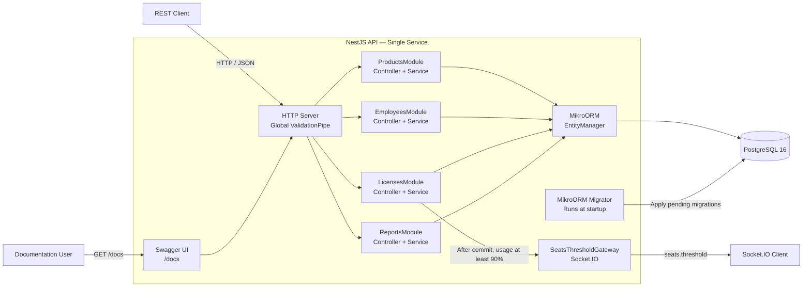
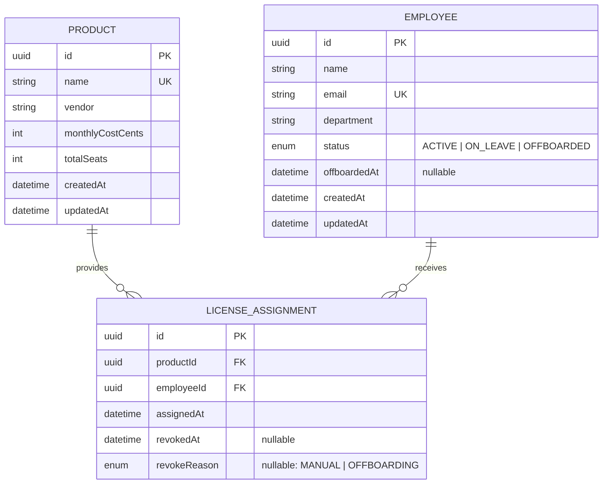
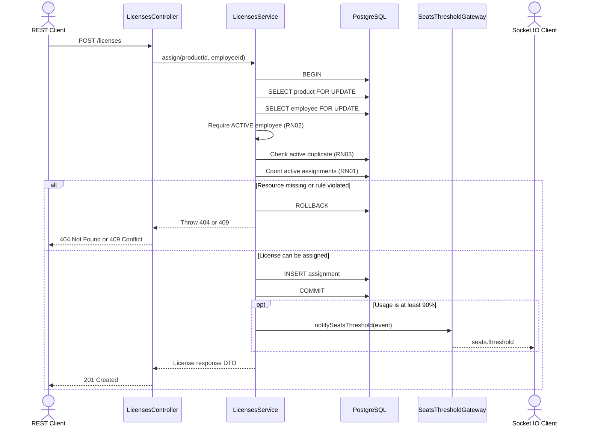

# LicenseHub

LicenseHub is a learning project I built while preparing for junior back-end opportunities. After finding roles that used NestJS, TypeScript, MikroORM, PostgreSQL, and Docker—technologies with which I had limited practical experience—I decided to learn them by building a complete but intentionally small application. Instead of creating an artificial example, I revisited a real software-license management problem I had encountered during an internship.

The result is a REST API for tracking who has each software license, how many seats remain available, how much they cost, and how much the company saves when an employee is offboarded.

## The problem

During my process automation internship, the IT team managed Microsoft licenses manually. Whenever someone was hired, offboarded, or went on leave, someone had to remember to assign or remove their license. In practice, the company kept paying for licenses assigned to former employees, and no one knew how many seats were available. I originally solved this problem with Power Platform; here, I rebuilt the solution as a back-end service with explicit, tested business rules and protection against concurrent requests.

## Features

- Product management with calculated used and available seats.
- Employee management with status and department filters.
- License assignment and revocation with a complete history; assignments are never deleted.
- Transactional offboarding that changes the employee status and releases all active licenses.
- Cost reports with total cost, cost by department, idle seats, and potential savings.
- Real-time WebSocket alerts when a product reaches 90% seat usage.
- Interactive Swagger documentation at `/docs`.

## System architecture

LicenseHub is a modular monolith: a single NestJS API organized into four domain modules, with PostgreSQL as its only database.



## Domain model



An assignment is active while `revokedAt` is `null` and is never deleted, preserving its history. The partial unique index `UNIQUE (product_id, employee_id) WHERE revoked_at IS NULL` prevents two active assignments of the same product to one employee while allowing reassignment after revocation.

## Business rules

| Code | Rule | Error |
|---|---|---|
| RN01 | A license can only be assigned if the product has an available seat (`seats in use < totalSeats`). | 409 |
| RN02 | Only employees with `ACTIVE` status can receive a license. | 409 |
| RN03 | An employee cannot have two active assignments of the same product. | 409 |
| RN04 | Offboarding changes the status to `OFFBOARDED`, sets `offboardedAt`, and revokes all active assignments with `revokeReason = OFFBOARDING` in a single transaction. | — |
| RN05 | An employee who is already `OFFBOARDED` cannot be offboarded again. | 409 |
| RN06 | An assignment that has already been revoked cannot be revoked again. | 409 |
| RN07 | `totalSeats` cannot be reduced below the number of seats in use. | 409 |
| RN08 | An `ON_LEAVE` employee keeps their current licenses but cannot receive new ones. | — |
| RN09 | Product `name` and employee `email` must be unique. | 409 |
| RN10 | A missing product, employee, or assignment returns not found. | 404 |

Invalid input—such as a missing field, wrong type, invalid email, unknown field, or non-UUID `:id`—returns **400**. Detailed endpoint behavior and acceptance criteria are documented in [`specs/`](specs/).

## Tech stack

| Technology | Why |
|---|---|
| **Node.js 22 LTS + TypeScript (`strict`)** | Strong typing catches errors before runtime, while LTS provides long-term support. |
| **NestJS 11** | Modules, dependency injection, and validation pipes keep the code organized by domain. Nest 11 is used because MikroORM 6's Nest adapter supports Nest 10/11. |
| **MikroORM 6** | Unit of Work, identity map, entity-based migrations, transactions, and locking through a straightforward API. |
| **PostgreSQL 16** | ACID transactions, `SELECT ... FOR UPDATE`, partial unique indexes, and enum constraints. |
| **class-validator + class-transformer** | Declarative DTO validation through a global `ValidationPipe`. |
| **@nestjs/config** | Environment-variable configuration through `.env`. |
| **@nestjs/swagger** | Interactive API documentation generated from DTOs. |
| **Jest** | Unit tests for services with a mocked `EntityManager`. |
| **Socket.IO** | Named real-time events, reconnection, and no client polling. |
| **Docker + Docker Compose** | Starts the database and API consistently with one command. |
| **ESLint + Prettier** | Automated code quality and formatting. |

## Getting started

**Prerequisites:** Docker. Node.js 22 is also required to run the seed and tests on the host.

```bash
git clone https://github.com/BrenoAlcaraz/licenseHub.git licensehub
cd licensehub
cp .env.example .env

# Start PostgreSQL and the API. Migrations are applied automatically.
docker compose up --build -d

# Populate the database with sample data: 4 products, 10 employees, and 17 assignments.
npm install
npm run seed
```

Without Node.js on the host, run the seed inside the container:

```bash
docker compose exec api node dist/database/seed.js
```

Swagger is available at **http://localhost:3000/docs**.

- The seed refuses to run if the database already contains data. To start over, run `docker compose down -v && docker compose up --build -d`.
- If port 5432 is already in use, change `DB_PORT` in `.env` (for example, to `5433`). This only changes the port published on the host.

For local development, run the API on the host and only the database in Docker:

```bash
docker compose up -d db
npm run start:dev
```

## Usage examples

The examples below demonstrate the complete **assign → offboard → report** flow with seed data. IDs are generated UUIDs; retrieve them from the list endpoints or Swagger.

**1. View products and available seats:**

```bash
curl http://localhost:3000/products
```

```json
[
  {
    "id": "…",
    "name": "Jira Software",
    "vendor": "Atlassian",
    "monthlyCostCents": 4000,
    "totalSeats": 8,
    "seatsInUse": 4,
    "seatsAvailable": 4
  }
]
```

**2. Assign a license to João Pereira:**

```bash
curl -X POST http://localhost:3000/licenses \
  -H "Content-Type: application/json" \
  -d '{"productId":"<jira-id>","employeeId":"<joao-id>"}'
```

Attempting to assign Slack Pro when all five seats are in use returns:

```json
{
  "statusCode": 409,
  "error": "Conflict",
  "message": "Product 'Slack Pro' has no available seats (5/5 in use)"
}
```

**3. Offboard Ana Souza:**

```bash
curl -X POST http://localhost:3000/employees/<ana-id>/offboard
```

```json
{
  "employeeId": "…",
  "status": "OFFBOARDED",
  "revokedLicenses": 3,
  "monthlySavingsCents": 27400
}
```

**4. View the cost report:**

```bash
curl http://localhost:3000/reports/costs
```

```json
{
  "totalMonthlyCostCents": 326000,
  "byDepartment": [
    { "department": "IT", "activeLicenses": 8, "monthlyCostCents": 77700 },
    { "department": "HR", "activeLicenses": 4, "monthlyCostCents": 69800 },
    { "department": "Finance", "activeLicenses": 3, "monthlyCostCents": 27400 }
  ],
  "idleSeats": ["…"],
  "potentialMonthlySavingsCents": 151100
}
```

Potential savings increase from 127,700 in the seed data to 151,100: +27,400 from Ana's released licenses and −4,000 from the Jira seat now used by João.

> **Windows:** `curl` in Git Bash or PowerShell may change the encoding of accented request-body text such as `"Fábio"`. Use Swagger or send JSON from a file with `-d @body.json`.

## Real-time alerts

When an assignment brings a product to at least **90% seat usage**, the API broadcasts a `seats.threshold` event through Socket.IO to all connected clients. It uses the same address and port as the API. See [`specs/realtime.spec.md`](specs/realtime.spec.md) for details.

```json
{
  "productId": "…",
  "productName": "Microsoft 365 E3",
  "seatsInUse": 9,
  "totalSeats": 10
}
```

To test it in a browser without installing anything:

1. Open http://localhost:3000/docs and the browser console (F12).
2. Paste the following code to load the Socket.IO client and listen for the event:

   ```js
   const s = document.createElement('script');
   s.src = '/socket.io/socket.io.js';
   s.onload = () => io().on('seats.threshold', (event) => console.log('ALERT', event));
   document.head.appendChild(s);
   ```

3. In Swagger, assign Microsoft 365 E3 (7/10 in the seed data) to João Pereira and then to Gabriela Nunes. At 9/10, the console displays the alert.

With Postman, create a Socket.IO request to `http://localhost:3000`, add `seats.threshold` under **Events**, enable **Listen**, connect, and make the assignments above.

## Running the tests

```bash
npm test          # unit tests: 61 tests in 4 suites
npm run test:cov  # generate the coverage report in coverage/
npm run lint      # ESLint + Prettier
npm run build     # full type checking

docker compose up -d db   # e2e tests require PostgreSQL
npm run test:e2e          # 14 end-to-end tests
```

- Unit tests cover all business rules in the services using a mocked `EntityManager`. Service line coverage ranges from 98% to 100%.
- End-to-end tests run against a separate real PostgreSQL database (`licensehub_e2e`) without touching seed data. They cover the complete flow, input validation, offboarding atomicity, concurrency, and real-time alerts. See [`specs/e2e.spec.md`](specs/e2e.spec.md).
- Each test name references its acceptance criterion, such as `LIC-AC07 (RN01) fails with 409 when the product has no available seats`.
- `npm run build` is part of verification because `ts-jest` does not type-check across files.

## Project structure

```text
licensehub/
├── specs/                   # acceptance criteria for each module; the source of truth
├── src/
│   ├── main.ts              # bootstrap: migrations, global ValidationPipe, Swagger
│   ├── app.module.ts        # combines config, MikroORM, and domain modules
│   ├── app.setup.ts         # shared HTTP configuration
│   ├── mikro-orm.config.ts  # database configuration for the app and migration CLI
│   ├── products/            # products, seat calculations, RN07, RN09
│   ├── employees/           # employees, statuses, offboarding: RN04, RN05, RN08
│   ├── licenses/            # assignment, revocation, and WebSocket alerts
│   ├── reports/             # cost and waste reports
│   └── database/
│       ├── migrations/      # versioned schema generated by MikroORM
│       └── seed.ts          # sample data
├── test/                    # e2e tests against PostgreSQL
├── Dockerfile               # multi-stage build and lean runtime image
└── docker-compose.yml       # PostgreSQL and API
```

Each domain module contains its entity, service, controller, DTOs, and service tests. Business rules live in services; controllers only handle HTTP concerns and delegate work.

## Spec-driven development

Nothing was implemented before being documented in [`specs/`](specs/). Each module followed this cycle:

1. **Spec:** define endpoints, exact error messages, and acceptance criteria in Given/When/Then form.
2. **Red:** write one failing test for each criterion before implementation.
3. **Green:** implement the entity, migration, DTOs, service, and controller until tests pass.
4. **Refactor:** clean up with green tests, then run lint and build checks.

Each criterion is marked `[unit]`, `[pipe]`, or `[manual]`. Searching for its ID finds both the spec and the test that guarantees it. Report figures in the spec are calculated from seed data, so the spec also serves as an acceptance test.

## Technical decisions

**Money stored as integer cents.** Floating-point numbers cannot represent decimal values exactly (`0.1 + 0.2 !== 0.3`). Integer cents make additions and multiplications exact; currency formatting belongs to the consumer.

**Revocation without deletion.** Revocation sets `revokedAt` and `revokeReason` instead of deleting the row. The assignment table becomes the complete history—who had which license, when, and why—without requiring a separate audit table.

**Transactional offboarding.** Changing an employee's status and revoking multiple licenses requires several writes. `em.transactional()` ensures that either every change is committed or none is. An `OFFBOARDED` employee can never retain an active license, and licenses cannot be revoked while the employee remains `ACTIVE`.

**Pessimistic locking for concurrency.** Every operation that reads, checks a rule, and writes locks the row that determines the rule with `SELECT ... FOR UPDATE` inside a transaction.

| Operation | Locked row | Protects |
|---|---|---|
| Assign a license | Product and employee | RN01 and RN02 |
| Reduce `totalSeats` | Product | RN07 against concurrent assignment |
| Offboard or change status | Employee | RN04 and RN05 |
| Revoke | Assignment | RN06 |

Without the product lock, 20 concurrent assignments to a product with one seat all succeeded. With the lock, exactly one succeeds and the other 19 receive 409 responses.

**Partial unique index for RN03.** `UNIQUE (product_id, employee_id) WHERE revoked_at IS NULL` enforces one active assignment per product/employee pair while allowing reassignment after revocation. The service checks first for a clear error message, and database violations are also converted to 409 responses.

### License assignment flow



The product lock serializes assignments competing for the last seat. The employee lock coordinates assignment with status changes and offboarding. The event is emitted after `COMMIT` but before the service returns the HTTP response.

**Database aggregation for reports.** SQL handles `COUNT`, `SUM`, and `GROUP BY`; TypeScript derives totals, waste, and sorting. Both queries run in a `REPEATABLE READ` transaction against the same snapshot, ensuring that `total cost − cost in use = potential savings` always balances.

**Alerts only after commit.** Emitting an event inside a transaction could notify IT about an assignment that later rolls back. The gateway only delivers the message; `LicensesService` decides when to notify. The threshold uses integer arithmetic (`seatsInUse × 100 ≥ totalSeats × 90`).

**Schema managed only through migrations.** The project does not use `schema:update` or `synchronize`. Migrations are generated from entities and applied automatically when the API starts.

**Domain-based organization.** Each domain folder contains everything related to that domain. To understand or change a rule, only one folder needs to be inspected.

## What I would add in production

- Corporate authentication and role-based authorization.
- Pagination for list endpoints.
- Auditing of the user responsible for each action.
- Real Microsoft Graph API integration and employee synchronization with Azure AD or HR systems.
- A queue with retries and idempotency for batch offboarding.
- A separate migration job before deploying multiple API replicas.
- `lock_timeout` and retry policies for operations that acquire locks.

## What I learned

This project gave me practical experience with NestJS modules, controllers, services, dependency injection, DTO validation, and Swagger documentation. I also learned how MikroORM handles entities, migrations, transactions, and database locking, and how Docker Compose provides a reproducible environment for an API and PostgreSQL.

More importantly, I learned how these tools fit together in a small back-end system: HTTP requests are validated at the application boundary, business rules remain in services, transactions protect multi-step operations, database constraints reinforce application rules, and automated tests make those decisions safer to change.

This project does not represent advanced mastery of every technology in the stack. Its purpose was to move beyond introductory study, gain hands-on experience, and practice explaining the technical decisions behind a complete application.

## Use of AI during development

I used Claude Code and Codex as pair-programming tools under constraints I defined in a project context document: follow a plan of small steps, stop after each step for my review, do not add dependencies or scope without asking, and explain every decision. I chose the spec-driven workflow—spec, failing test, implementation—to stay in control and approved each spec before code was written.

Examples of what I reviewed, corrected, or rejected:

- **Framework version:** the latest CLI generated NestJS 12 with Vitest and oxlint. Because the MikroORM 6 adapter does not support Nest 12 and the target role mentions Jest and ESLint, I chose Nest 11.
- **RN01 concurrency:** the first version checked seat availability without a lock. We reproduced the bug with 20 simultaneous assignments to a one-seat product before fixing it.
- **Fixing the fix:** the first lock implementation read the product before locking it, which allowed stale data. We changed it to read while acquiring the lock and applied the same pattern to other state-changing operations.
- **A test that proved nothing:** sequential `curl` processes started too slowly to reproduce a race. A script using `Promise.all` exposed the bug, and I added tests for both arrival orders.
- **Green tests, broken build:** an entity getter passed Jest but failed TypeScript compilation because `ts-jest` does not type-check across files. `npm run build` is now part of every verification step.
- **Database enforcement for RN03:** I approved a partial unique index beyond the original plan because it guarantees the rule even if two requests pass the service check simultaneously.
- **An incorrect AI claim:** the AI claimed that `70 × 0.9` produces `63.00000000000001` in JavaScript. We verified that it produces exactly `63`; an exhaustive check found the floating-point issue at other percentages instead. We kept integer arithmetic but corrected the justification.
- **Safe seed behavior:** the seed refuses to run against a database that already contains data instead of deleting it, preventing accidental data loss.
